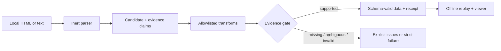

<div align="center">

# grounded-json

**Extract structured data. Keep the proof.**

Turn local HTML into schema-valid JSON plus field-level evidence.

[](https://github.com/msertdev/grounded-json/actions/workflows/ci.yml)
[](https://github.com/msertdev/grounded-json/actions/workflows/codeql.yml)
[](https://www.npmjs.com/package/grounded-json)
[](https://nodejs.org/)
[](./LICENSE)

`local-only` · `deterministic replay` · `no browser` · `no external service`

</div>

Most extractors stop at JSON. That is where review starts.

`grounded-json` returns the data and its receipt together. Each terminal value is linked to a source snapshot, an evidence quote, an optional CSS anchor, and every normalization step used to reproduce it. In strict mode, unsupported values do not silently enter the result.

> Inputs vary. Evidence decides.

## See it in ten seconds

```bash
npx grounded-json demo
```

```text
PASS  4/4 fields are source-backed
      /name <- "Field Notes Pro"
      /price <- 129
      /currency <- "USD"
      /available <- true
      sha256:5e82ebe5…
```

The demo is deterministic and uses built-in local data. It makes no network requests.

## Install

```bash
npm install grounded-json
```

Node.js 22 or newer is required. The package is ESM-only and ships its own TypeScript declarations.

## Extract a real local page

Save a page you are allowed to process, then point the CLI at its JSON-LD and a declarative schema:

```bash
grounded-json from-jsonld ./page.html \
  --type Product \
  --schema ./schema.json \
  --out ./receipt.json

grounded-json verify ./receipt.json ./page.html
grounded-json inspect ./receipt.json --out ./receipt.html
```

The last command creates a self-contained, script-free review report. Try the committed [product](./examples/product), [job posting](./examples/job), and [article](./examples/article) fixtures.

## What comes back

```json
{
  "data": {
    "name": "Northstar Pack 24L",
    "offers": {
      "price": 149.95,
      "priceCurrency": "USD"
    }
  },
  "evidence": {
    "/offers/price": [
      {
        "quote": "149.95",
        "selector": "script[type=\"application/ld+json\"]",
        "transforms": ["json-decode"],
        "sourceHash": "sha256:…",
        "status": "grounded",
        "observedValue": 149.95
      }
    ]
  },
  "coverage": {
    "grounded": 2,
    "total": 2,
    "ratio": 1
  }
}
```

The complete receipt also contains its format version, creation time, content-addressed source metadata, schema digest, structured issues, and a digest over the receipt payload.

## Why grounded-json?

| Typical extraction                     | grounded-json                                          |
| -------------------------------------- | ------------------------------------------------------ |
| Returns a plausible value              | Replays the value from cited source evidence           |
| Hides cleanup and coercion             | Records allowlisted transforms                         |
| Treats missing data as an afterthought | Surfaces missing, ambiguous, and invalid evidence      |
| Couples review to a scraper run        | Produces a portable receipt and offline viewer         |
| May execute page or schema code        | Parses HTML inertly; CLI accepts declarative JSON only |

This is useful for automated pipelines, product and job data, dataset provenance, research review, ETL validation, and any human-in-the-loop workflow that needs receipts instead of confidence scores.

## Guarantees

When strict extraction succeeds:

- The emitted value passes the requested Zod schema or safe JSON Schema subset.
- Every emitted terminal—including `null`, `false`, `0`, an empty string, and empty containers—has source evidence.
- Each observed value can be recomputed with a small allowlist of deterministic transforms.
- Source bytes are bound by SHA-256; verification never refetches them.
- Duplicate or ambiguous anchors cause abstention instead of a guessed match.
- HTML and JSON-LD are parsed as inert data. Page scripts are never executed.

**Evidence supports where a value came from—not that the source itself is true.** A digest proves receipt integrity, not authorship, time of publication, legal compliance, or factual correctness.

## SDK

Explicit selectors work well when you control the page shape:

```ts
import { fromSelectors } from 'grounded-json';

const receipt = fromSelectors({
  html,
  selectors: {
    '/name': { selector: 'main h1' },
    '/price': {
      selector: '[data-price]',
      attribute: 'data-price',
      transforms: ['parse-number'],
    },
  },
});
```

JSON-LD extraction can project one schema.org node into a portable JSON Schema receipt:

```ts
import { fromJsonLd } from 'grounded-json';

const receipt = fromJsonLd({
  html,
  type: 'Product',
  jsonSchema: {
    type: 'object',
    required: ['name'],
    properties: { name: { type: 'string' } },
    additionalProperties: false,
  },
});
```

For an existing candidate from any upstream process, use the low-level gate:

```ts
import { ground } from 'grounded-json';
import { z } from 'zod';

const receipt = ground({
  data: { title: 'Evidence over confidence' },
  sources: [{ mediaType: 'text/plain', content: sourceText }],
  evidence: [{ pointer: '/title', quote: 'Evidence over confidence' }],
  schema: z.object({ title: z.string() }),
  options: { strict: true },
});
```

Zod callbacks are trusted application code and belong in the SDK path. The CLI never imports `.js` or `.ts` schema files.

## How it works



The verifier is offline and deterministic: it checks snapshot hashes, finds each anchor again, replays transforms, performs type-strict comparison, validates the portable schema, and recomputes coverage. Stored status labels are never trusted by themselves.

## Safe JSON Schema subset

Portable CLI receipts intentionally support a narrow draft 2020-12 subset:

- `type`
- `properties`
- `required`
- `items`
- `enum`
- boolean `additionalProperties`
- documentation fields: `$schema`, `title`, `description`

Every node must declare one type. Dynamic references, regexes, arbitrary formats, custom keywords, and executable schemas are rejected. This is a security boundary, not an incomplete general-purpose validator.

## Security and privacy defaults

- CLI input is local UTF-8 only, capped at 5 MiB per source.
- URL fetching, redirects, authentication, browser automation, plugins, telemetry, and recursive crawling are out of scope for v0.1.
- Source bytes are excluded from receipts unless `--embed-source` is explicitly passed; quotes may still contain sensitive data.
- Output files are created exclusively by default. Replacing one requires `--force`, and input files cannot be overwritten.
- The offline report has a restrictive Content Security Policy and escapes all source-controlled text.
- JSON Pointers, schema keys, and decoded values reject prototype-pollution keys.

Please report vulnerabilities according to [SECURITY.md](./SECURITY.md).

## Honest limits

- v0.1 evidence uses a selector plus a unique quote inside a deterministic normalized `textContent` projection; byte-range evidence is planned.
- A repeated quote is ambiguous unless the surrounding selector resolves it uniquely.
- It does not verify all claims made by a page or discover every possible contradiction.
- It does not bypass CAPTCHAs, authentication, or anti-bot controls.
- It does not execute client-rendered apps; save or render the permitted page yourself.
- A source hash identifies the bytes used. It is not permanent web archival or a digital signature.

## Develop locally

```bash
git clone https://github.com/msertdev/grounded-json.git
cd grounded-json
npm ci
npm run check
npm run demo
```

Node.js 22 or newer is required. The test suite covers deterministic replay, tampering, ambiguous evidence, inert parsing, prototype pollution, sparse arrays, schema safety, offline viewer escaping, and CLI boundaries.

## Roadmap

- Exact UTF-8 byte-range evidence and versioned text projections
- A separately packaged, SSRF-hardened URL acquisition adapter
- Explicit browser adapter for client-rendered pages
- More portable transforms with conformance fixtures
- Signed receipts and timestamp-authority integration
- Corpus-based compatibility reporting—without invented benchmarks

See [CONTRIBUTING.md](./CONTRIBUTING.md) before opening a pull request.

## License

MIT © 2026 [Murat Sert](https://github.com/msertdev)
